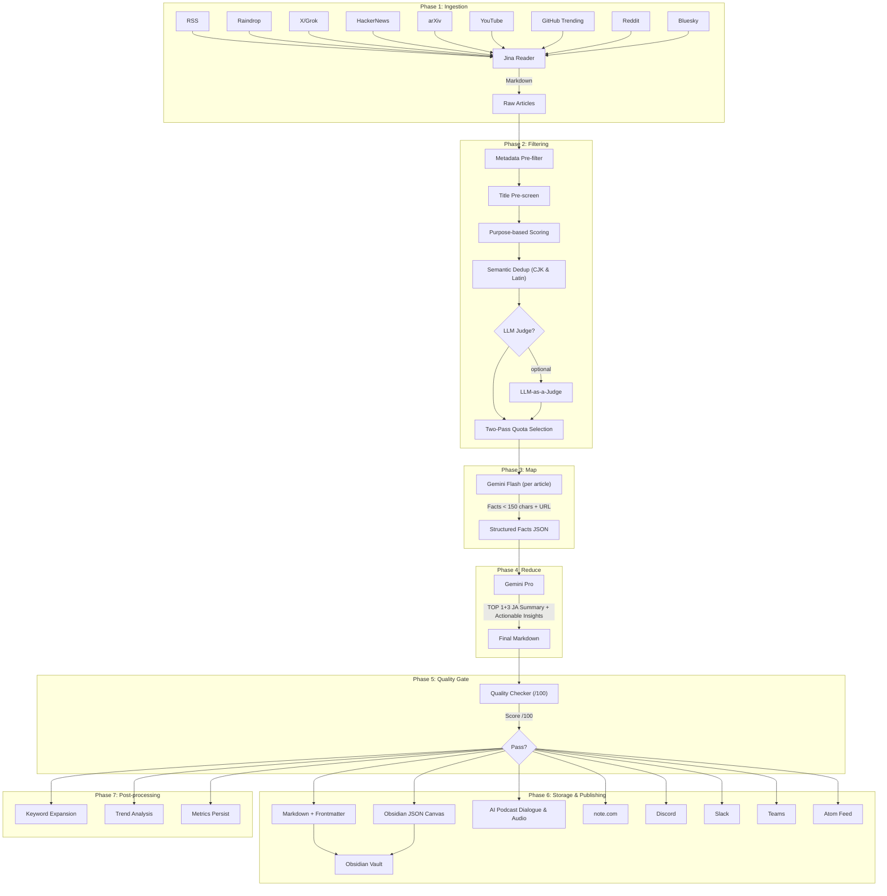
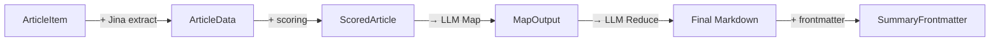

# Architecture

## Pipeline Overview

Digital Trend Flow は 7 フェーズの Map-Reduce パイプラインで構成されています。



---

## Core Data Models

パイプラインは **5 つの中間データモデル** でフェーズ間を接続しています。各モデルは TypeScript の `interface` として型定義され、フェーズ間の契約 (Contract) を明示します。

### データモデル一覧



---

### 1. `ArticleItem` — Ingestion 出力

ソースアダプター（RSS, Raindrop, Grok 等）が共通で返す **正規化済み記事メタデータ**。全 7 ソースがこの型に変換して返す。

```typescript
// src/ingestion/rss.ts
interface ArticleItem {
  sourceName: string;   // 情報源の表示名
  sourceType: string;   // "rss" | "raindrop" | "xai_grok" | ...
  purpose: string;      // config.purposes のキー
  title: string;        // 記事タイトル
  url: string;          // 正規化済み URL
  publishedAt: string;  // ISO 8601
  language?: string;    // "ja" | "en" (多言語対応)
}
```

**境界の意図**: ソースごとに異なる生データ形式（RSS XML, Raindrop JSON, HN API 等）をすべて `ArticleItem` に正規化することで、下流のフィルタリングは**ソースの種類を一切知らない**。新規ソース追加時も、この型に変換すれば既存パイプラインがそのまま動作する。

### 2. `ArticleData` — Filtering 入力

Jina Reader で本文 Markdown を抽出した後の **コンテンツ付き記事データ**。

```typescript
// src/filtering/scorer.ts
interface ArticleData {
  url: string;          // 正規化済み URL
  title: string;
  content: string;      // Jina Reader が返した Markdown 本文
  publishedAt?: string; // 鮮度スコアリング用
  language?: string;
}
```

**`ArticleItem` → `ArticleData` の変換**: `main.ts` の Phase 2 で Jina Reader の結果を合成する。`content` フィールドが追加される点が `ArticleItem` との唯一の差分。

### 3. `PurposeScoreOutput` — Scoring 出力

スコアリングエンジンが返す **評価結果**。除外判定・スコア・マッチしたキーワード・割り当てカテゴリを含む。

```typescript
// src/filtering/scorer.ts
interface PurposeScoreOutput {
  isExcluded: boolean;
  exclusionReason?: string;
  assignedPurpose: string;    // config.purposes のキー
  purposeLabel: string;       // "🔬 AI・LLM 研究" 等
  totalScore: number;
  matchedKeywords: string[];
  llmJudgeScore?: number;     // LLM-as-Judge 評価 (opt-in)
  freshnessFactor?: number;   // 鮮度係数 (0.3–1.0)
  detectedTopics?: string[];
}
```

**内部中間型 `ScoredArticle`**: `main.ts` でのみ使用されるパイプライン内部型。`ArticleData` + `PurposeScoreOutput` を合成する。

```typescript
// src/main.ts (パイプライン内部型)
interface ScoredArticle {
  article: ArticleData;
  score: number;
  purpose: string;
  purposeLabel: string;
  matchedKeywords: string[];
}
```

### 4. `MapInput` / `MapOutput` — LLM Map フェーズ

Map フェーズの入出力。1 記事 → 1-5 個の構造化ファクトに圧縮する。

```typescript
// src/summarization/gemini_map.ts
interface MapInput {
  title: string;
  url: string;
  content: string;      // Markdown 本文 (最大 10,000 字に truncate)
  language?: string;
}

interface ExtractedFact {
  text: string;         // 150 字以内の簡潔なファクト
  importance: number;   // 1-10 の重要度
}

interface MapOutput {
  source_title: string; // 出典タイトル (Citation 用)
  source_url: string;   // 出典 URL (Citation 用)
  facts: ExtractedFact[];
}
```

**Reduce 入力時の拡張**: `main.ts` で `MapOutput` に `purpose` / `purposeLabel` / `score` をマージして Reduce に渡す。

```typescript
// Reduce への入力 (main.ts で合成)
type ReduceInput = MapOutput & {
  purpose: string;
  purposeLabel: string;
  score: number;
};
```

### 5. `SummaryFrontmatter` — Storage 出力

Obsidian Vault に保存する Markdown の YAML Frontmatter 構造。DataView クエリ最適化済み。

```typescript
// src/storage/markdown_builder.ts
interface SummaryFrontmatter {
  tags?: string[];
  categories?: string[];
  sources?: string[];
  topStory?: string;
  previousDate?: string;
  // DataView 拡張フィールド
  articleCount?: number;
  topPurpose?: string;
  mentionedCompanies?: string[];
  mentionedTechnologies?: string[];
  estimatedCostUsd?: number;
  executionTimeSec?: number;
  qualityScore?: number;
  relatedNotes?: string[];
}
```

---

## Data Flow — フェーズ間のスキーマ変換

以下は 1 記事がパイプラインを通過する際の、各フェーズでのデータ形態の変化を示します。

```txt
Phase 1: Ingestion
  外部 API 応答 (RSS XML, JSON, HTML)
       ↓ ソースアダプター (7種)
  ArticleItem { sourceName, sourceType, purpose, title, url, publishedAt }
       ↓ State Manager: isProcessed(url) で重複排除
       ↓ Jina Reader: extractMarkdown(url) → Markdown 本文
Phase 2: Filtering
  ArticleData { url, title, content, publishedAt }
       ↓ excludeByMetadata(): ドメイン・NGワードチェック
       ↓ titlePassesPreScreen(): タイトルプレスクリーン
       ↓ calculatePurposeScore(): キーワードマッチ + 鮮度 + TF-IDF
       ↓ semanticDedup(): タイトル類似度で重複排除
       ↓ (optional) llmJudgeScore(): LLM 関連性評価
       ↓ twoPassSelect(): Min/Max クォータで選定
  ScoredArticle { article, score, purpose, purposeLabel, matchedKeywords }

Phase 3: Map (per article)
  MapInput { title, url, content (≤10,000字) }
       ↓ LLM Gateway → Gemini Flash
  MapOutput { source_title, source_url, facts[{text, importance}] }

Phase 4: Reduce (batch)
  ReduceInput[] = MapOutput + { purpose, purposeLabel, score }
       ↓ LLM Gateway → Gemini Pro
  Final Markdown (日本語 TOP 1+3 サマリー)

Phase 5: Quality Gate
  summaryMarkdown + expectedSourceUrls
       ↓ evaluateQuality()
  QualityCheckResult { overallScore, checks[], passCount, failCount }

Phase 6: Storage & Publishing
  Markdown + SummaryFrontmatter → Obsidian Vault
  Markdown → Discord / Slack / Teams / note.com / Atom Feed

Phase 7: Post-processing
  markAsProcessed() → SQLite
  metrics.persist() → JSON
  savePipelineRun() → SQLite
```

---

## Configuration Schema (Zod)

`config.yml` と環境変数はすべて **Zod 4 スキーマ** でバリデーションされます。不正な設定はパイプライン起動前に拒否されます。

### ConfigSchema 構造

```typescript
// src/core/types.ts
ConfigSchema = z.object({
  version: z.string(),                    // "2.0"
  settings: z.object({
    daily_threshold_score: z.number(),
    models: ModelProviderSchema,          // { platform, map, reduce, thinking }
    fallback_models: FallbackModelSchema, // optional
    author: z.string(),
    freshness: { enabled, decay_lambda, max_age_hours },
    state_ttl_days: z.number(),
    llm_judge: { enabled, weight },
    semantic_dedup: { enabled, similarity_threshold },
  }),
  purposes: z.record(string, PurposeSchema),  // 動的キー
  exclude: ExcludeSchema,
});
```

### SourceSchema — Discriminated Union

ソースの型安全性は `z.discriminatedUnion("type", [...])` で保証されます。`type` フィールドの値に応じて、必須・任意フィールドが自動的に切り替わります。

```typescript
SourceSchema = z.discriminatedUnion("type", [
  z.object({ type: z.literal("rss"),            name, url, language? }),
  z.object({ type: z.literal("xai_grok"),       name, query, language? }),
  z.object({ type: z.literal("raindrop"),       name, collection_id, archive_collection_id?, lookback_hours }),
  z.object({ type: z.literal("hackernews"),     name, min_score, max_items }),
  z.object({ type: z.literal("arxiv"),          name, query, max_results }),
  z.object({ type: z.literal("youtube"),        name, channel_id?, query?, max_results }),
  z.object({ type: z.literal("github_trending"), name, language_filter?, since }),
]);
```

### EnvSchema — Secret バリデーション

```typescript
EnvSchema = z.object({
  GEMINI_API_KEY: z.string().min(1),         // Required
  RAINDROP_TEST_TOKEN: z.string().optional(), // Optional sources
  XAI_API_KEY: z.string().optional(),
  YOUTUBE_API_KEY: z.string().optional(),
  OPENAI_API_KEY: z.string().optional(),      // Fallback LLM
  ANTHROPIC_API_KEY: z.string().optional(),
  // ... publishing, observability keys
});
```

---

## Persistence Schema (SQLite)

`pipeline_state.db` は WAL モードで動作し、3 テーブルでパイプラインの状態を管理します。

### processed_urls — 冪等性保証

| Column         | Type    | Description                |
| :------------- | :------ | :------------------------- |
| `url`          | TEXT PK | 正規化済み記事 URL         |
| `title`        | TEXT    | 記事タイトル               |
| `score`        | REAL    | パイプラインスコア         |
| `purpose`      | TEXT    | 割り当てカテゴリ           |
| `processed_at` | TEXT    | 処理日時                   |
| `expires_at`   | TEXT    | TTL 期限 (default: +90 日) |

### pipeline_runs — 実行履歴

| Column                | Type    | Description           |
| :-------------------- | :------ | :-------------------- |
| `run_id`              | TEXT PK | UUID                  |
| `date`                | TEXT    | 実行日                |
| `articles_ingested`   | INTEGER | 取得記事数            |
| `articles_scored`     | INTEGER | スコアリング通過数    |
| `articles_selected`   | INTEGER | 最終選定数            |
| `articles_by_purpose` | TEXT    | カテゴリ別分布 (JSON) |
| `total_input_tokens`  | INTEGER | 入力トークン合計      |
| `total_output_tokens` | INTEGER | 出力トークン合計      |
| `total_cost_usd`      | REAL    | 推定コスト合計        |
| `quality_score`       | REAL    | 品質スコア            |
| `metrics_json`        | TEXT    | 完全メトリクス (JSON) |

### source_health — ソース健全性

| Column          | Type    | Description              |
| :-------------- | :------ | :----------------------- |
| `source_name`   | TEXT    | ソース名                 |
| `source_type`   | TEXT    | ソース種別               |
| `check_date`    | TEXT    | チェック日               |
| `status`        | TEXT    | `ok` / `empty` / `error` |
| `article_count` | INTEGER | 取得記事数               |
| `error_message` | TEXT    | エラー詳細               |

PK: `(source_name, check_date)`

---

## Boundary Design — 変化に強い構造

### 設計原則

このシステムは「**情報源は頻繁に増減する**」「**LLM プロバイダーは変わりうる**」「**出力先は要件で追加される**」という前提で設計されています。以下の 4 つの境界で変化を局所化します。

### Boundary 1: Source Adapter 境界

```txt
外部 API (RSS XML, JSON, HTML, ...)
    ↓ ソースアダプター (src/ingestion/*.ts)
ArticleItem (正規化済み共通型)
    ↓ パイプライン本体 (src/main.ts)
```

**何を隔離しているか**: 外部 API の形式・認証方式・ページネーション・エラー処理をアダプター内に閉じ込めています。`main.ts` は `ArticleItem[]` しか受け取りません。

**変化への耐性**:

- **新規ソース追加**: `src/ingestion/` にアダプターを 1 ファイル追加し、`SourceSchema` に discriminated union のバリアントを追加するだけ。既存コードの変更は `main.ts` のルーティング部分のみ。
- **既存ソースの API 変更**: 該当アダプター内のみ修正。`ArticleItem` の契約が守られる限り下流への影響はゼロ。
- **ソースの無効化**: API キー未設定で自動スキップ。設定ファイルからソースを削除するだけ。

### Boundary 2: LLM Gateway 境界

```txt
パイプライン (Map/Reduce/Judge)
    ↓ LLMRequest (統一リクエスト型)
llm_gateway.ts
    ↓ プロバイダー固有 API (Gemini, OpenAI, Anthropic)
LLMResponse (統一レスポンス型)
    ↓ パイプラインに復帰
```

**何を隔離しているか**: LLM プロバイダーの API 仕様差（認証ヘッダー、リクエスト形式、Structured Output の指定方法、トークンカウントの取得方法）をゲートウェイ内に閉じ込めています。

```typescript
// 呼び出し側は provider を意識しない
interface LLMRequest {
  systemPrompt: string;
  userPrompt: string;
  phase: "map" | "reduce" | "judge" | ...;
  responseSchema?: Record<string, unknown>;  // Structured Output
  temperature?: number;
  maxOutputTokens?: number;
}

interface LLMResponse {
  text: string;
  model: string;
  provider: string;
  inputTokens: number;
  outputTokens: number;
  latencyMs: number;
}
```

**変化への耐性**:

- **プロバイダー追加**: `callProvider()` 内に `case` を追加するだけ。
- **プロバイダー障害**: Circuit Breaker が自動フォールバック（連続 3 回失敗 → 5 分 OPEN → 次プロバイダーへ）。
- **モデル更新**: `config.yml` の `latest-flash` / `latest-pro` で自動解決。コード変更不要。
- **Structured Output 対応差**: `responseSchema` の有無でプロバイダーごとに適切な形式に変換。

### Boundary 3: Scoring / Filtering 境界

```txt
config.yml (purposes, scoring, exclude)
    ↓ Zod パース → 型安全な AppConfig
ArticleData
    ↓ scorer.ts (純粋関数: LLM 呼び出しなし※)
PurposeScoreOutput
```

※ `llmJudgeScore()` は opt-in で、デフォルト OFF。

**何を隔離しているか**: スコアリングのロジック（キーワードマッチ、TF-IDF、鮮度計算、除外ルール）と、ビジネスルール（どのカテゴリに何点以上で採用するか）を分離しています。

**変化への耐性**:

- **カテゴリの追加・変更**: `config.yml` の `purposes` セクションを編集するだけ。コード変更不要。
- **キーワードの追加・重み調整**: `config.yml` の `keywords` を変更するだけ。
- **除外ルールの強化**: `exclude` セクションにドメイン・キーワードを追加。正規表現もサポート。
- **スコアリングアルゴリズム変更**: `scorer.ts` 内で完結。入出力型が同じなら他モジュールに影響しない。

### Boundary 4: Publishing 境界

```txt
Final Markdown + SummaryFrontmatter
    ↓ Publishing Adapter (src/publishing/*.ts)
外部プラットフォーム (Discord, Slack, Teams, note.com, Atom)
```

**何を隔離しているか**: 各配信先のウェブフック形式・API 仕様・文字数制限・フォーマット変換を個別アダプター内に閉じ込めています。

**変化への耐性**:

- **配信先の追加**: `src/publishing/` にアダプターを追加。`main.ts` から呼ぶだけ。
- **配信先の無効化**: 環境変数 (Webhook URL 等) 未設定で自動スキップ。
- **Plugin Registry**: `PluginRegistry.registerPublishing()` で動的登録も可能（Event Bus 経由）。

### 境界の全体像

```txt
┌──────────────────────────────────────────────────────┐
│  config.yml + .env                                   │
│  ┌─────────────────────────────────────────────────┐ │
│  │  Zod Schema Validation (types.ts)               │ │
│  │  → AppConfig / EnvConfig (型安全な設定)          │ │
│  └─────────────────────────────────────────────────┘ │
│                                                      │
│  ┌─── Boundary 1 ───┐  ┌─── Boundary 3 ──────────┐ │
│  │ Source Adapters   │  │ Scorer (pure functions)  │ │
│  │ (7 types)         │  │ config-driven rules     │ │
│  │   ↓ ArticleItem   │  │   ↓ PurposeScoreOutput  │ │
│  └───────────────────┘  └─────────────────────────┘ │
│                                                      │
│  ┌─── Boundary 2 ───────────────────────────────────┐│
│  │ LLM Gateway (llm_gateway.ts)                     ││
│  │  LLMRequest → [Gemini|OpenAI|Anthropic] →        ││
│  │  LLMResponse + Circuit Breaker                   ││
│  └──────────────────────────────────────────────────┘│
│                                                      │
│  ┌─── Boundary 4 ───┐  ┌── Persistence ──────────┐ │
│  │ Publishing        │  │ SQLite (WAL mode)       │ │
│  │ (5 channels)      │  │ processed_urls          │ │
│  │   ↑ Markdown      │  │ pipeline_runs           │ │
│  └───────────────────┘  │ source_health           │ │
│                          └────────────────────────┘ │
└──────────────────────────────────────────────────────┘
```

---

## Map-Reduce 戦略

大量の記事を直接高性能モデルに渡すと **API コストが爆発** し、Long Context での品質低下も発生します。

| Phase      | Model        | Role                                              | Input Limit     |
| :--------- | :----------- | :------------------------------------------------ | :-------------- |
| **Map**    | Gemini Flash | 各記事 → Facts (< 150 字) + 出典 URL を JSON 抽出 | ~10,000 字/記事 |
| **Reduce** | Gemini Pro   | 全 Facts → 日本語 "TOP 1+3" サマリーに統合        | 全 Facts JSON   |

**効果**: コスト 1/10 以下、出力品質の安定化、出典 URL の完全追跡。

**Reduce の入力制限**: `MAX_REDUCE_INPUT_CHARS = 200,000` を超える場合、`importance < 5` のファクトを自動プルーニング。

## Multi-LLM Gateway

`src/summarization/llm_gateway.ts` が Google Gemini / OpenAI / Anthropic を統一インターフェースで抽象化します。

### Circuit Breaker Pattern

```txt
Provider A (primary) → 失敗 3 回 → Circuit OPEN → Provider B にフォールバック
                            ↓ (5 分 cooldown)
                       Circuit CLOSED → Provider A に復帰
```

- **閾値**: 連続 3 回失敗で回路 OPEN
- **Cooldown**: 5 分で自動復帰
- **非フォールバック**: 400/401/403 (クライアントエラー) は即座に re-throw

### Auto Model Resolution

`config.yml` で `latest-flash` / `latest-pro` を指定すると、Gemini API の `models` エンドポイントから最新の安定モデルを自動解決します。実験的モデル (`-exp`) は自動除外。

## Plugin Architecture

`src/core/plugin_registry.ts` により、ソースとパブリッシャーの追加がコード変更なしで可能です。

### Plugin Interfaces

```typescript
interface IngestionPlugin {
  readonly name: string;
  readonly type: string;
  fetch(config: Record<string, unknown>, purpose: string): Promise<ArticleItem[]>;
}

interface PublishingPlugin {
  readonly name: string;
  publish(title: string, content: string, articleCount: number): Promise<void>;
}
```

### Event Bus

パイプラインの各フェーズで以下のイベントが発火されます:

| Event                | Timing                   |
| :------------------- | :----------------------- |
| `ingestion:start`    | パイプライン開始時       |
| `ingestion:complete` | 全ソース取得完了         |
| `scoring:complete`   | フィルタリング・選定完了 |
| `map:complete`       | Map フェーズ完了         |
| `reduce:complete`    | Reduce フェーズ完了      |
| `quality:complete`   | 品質評価完了             |
| `publish:complete`   | 全チャンネル配信完了     |
| `pipeline:complete`  | パイプライン正常終了     |
| `pipeline:error`     | 致命的エラー発生         |

## Quality Gate

`src/evaluation/quality_checker.ts` が 6 項目で出力品質を自動評価します（100 点満点）:

| Check              | Weight | Criteria                              |
| :----------------- | :----- | :------------------------------------ |
| Format Compliance  | 均等   | 🔥 トップニュース + カテゴリセクション |
| Length Compliance  | 均等   | 2,000-8,000 字                        |
| Citation Accuracy  | 均等   | 期待 URL の 50% 以上が出現            |
| Language Check     | 均等   | 日本語文字比率 15% 以上               |
| Markdown Structure | 均等   | 壊れたリンク・未閉じフォーマットなし  |
| No Empty Sections  | 均等   | 空セクションなし                      |

## Observability

| Layer                      | Mechanism                                                         |
| :------------------------- | :---------------------------------------------------------------- |
| **Cost Tracking**          | LLM コール毎のトークン数・推定コストを記録                        |
| **Metrics JSON**           | `artifacts/contents/digital-trend/collection/metrics/` に日次出力 |
| **Langfuse**               | トレース・スパン・品質スコアを送信 (optional)                     |
| **GitHub Actions Summary** | `$GITHUB_STEP_SUMMARY` にパイプライン結果を出力                   |

## Output Structure

```txt
artifacts/contents/
├── digital-trend/
│   └── collection/
│       ├── daily/YYYY/MM/YYYY-MM-DD_digital-trend_daily_summary.md
│       ├── monthly/YYYY/YYYY-MM-DD_digital-trend_monthly_report.md
│       ├── yearly/YYYY-MM-DD_digital-trend_yearly_report.md
│       └── metrics/YYYY-MM-DD_metrics.json
└── publish/
    ├── note/
    └── zenn/
```
